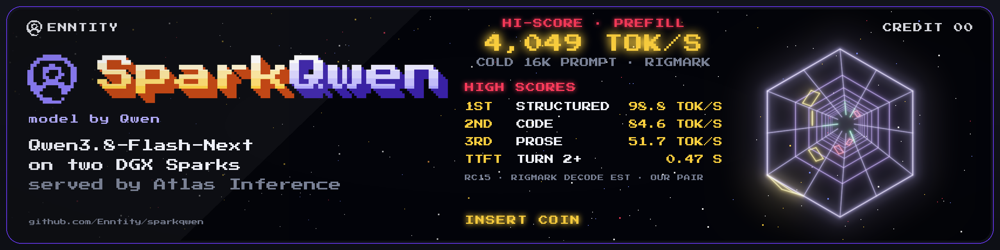

<p align="center">
  
</p>

# SparkQwen

Qwen3.8-Flash-Next on two NVIDIA DGX Sparks, served by the
[Atlas](https://github.com/Enntity/atlas) inference engine: tensor and expert
parallelism across both boxes over one ConnectX-7 cable, NVIDIA's NVFP4
checkpoint loaded as published, the model's own MTP head for speculative
decoding, prefix caching, and an OpenAI-compatible API. It is the sibling of
[SparkGLM](https://github.com/Enntity/sparkglm), whose engine work, serving
policy and measurement rules it applies to Qwen's hybrid MoE (Gated DeltaNet
and sparse-indexed attention, 512 experts, PLE n-gram embedding).

```sh
git clone https://github.com/Enntity/sparkqwen.git
cd sparkqwen
cp .env.example .env      # set WORKER to the other Spark's ssh destination
./start.sh
```

**Status: release candidate 15.** The engine is pinned
([`install/atlas-source.json`](install/atlas-source.json): Enntity/atlas
`sparkqwen/atlas-20261008-rc15` at de4386b4). `./start.sh` from a clean
clone built the image, served the pair and reproduced the numbers below on
our Sparks; no image is published yet, so the first start builds one
([docs/LIMITATIONS.md](docs/LIMITATIONS.md)).

## What it does

Measured on two DGX Sparks joined by one 200G cable, through the recipe's own
image with the default profile, and against vLLM v0.30 run on the same pair
with MiaAI-Lab's dual-Spark settings. Receipts and caveats:
[2026-10-08-rc15](results/2026-10-08-rc15/RESULT.md) (earlier:
[2026-10-06-pinned](results/2026-10-06-pinned/RESULT.md),
[bring-up](results/2026-10-05-bringup/RESULT.md)).

| Workload | SparkQwen (Atlas, two Sparks) | vLLM v0.30, same pair |
|---|---|---|
| sparkDash decode, one stream: structured / prose / code / JSON (thinking off, 400 tokens) | **101.9 / 72.7 / 94.2 / 84.9 tok/s** | 77.3-77.7 / 61.0-62.1 / 71.3-72.2 / 65.8-66.4 |
| sparkDash aggregate, 8 streams | **389.6 / 261.1** / 297.1 / 333.1 tok/s | 361.7-376.3 / 237.9-241.2 / 290.8-307.0 / 331.1-338.6 |
| RigMark decode estimate: code / prose / structured | **84.6 / 51.7 / 98.8 tok/s** | 68.0 / 44.4 / 76.0 |
| RigMark cold 16K-token prefill | **4,049 tok/s** | 3,516 tok/s |
| RigMark end-to-end concurrency, C1 / C2 / C4 / C8 | 61.6 / 97.5 / 165.6 / 261.1 tok/s | 57.1 / 99.0 / 163.9 / 255.0 |
| RigMark output gates | 8/9 (one greedy code run loops) | **9/9** |
| Cold prompt 2K / 8K / 16K / 28K: time to first token | 0.73 / 2.10 / 4.17 / 7.48 s | 16K: 4.60 s |
| 77K-token needle: time to first token, decode | **21.1 s, 58.4 tok/s** (`4x262k`); 21.5 s, 50.6 tok/s (`8x262k`) | 22.3 s, 50.6 tok/s (8 x 262K) |
| Agent follow-up turns, 4 concurrent conversations: median time to first token | 0.47 s | **0.33 s** |
| KV pool, each at its recipe's memory setting | **3.2-3.4M tokens** (util 0.88) | 1.5M tokens (util 0.80) |
| Quality probe: arithmetic / two-hop 24K needle | 40/40 · 12/12 | |

vLLM ranges are two runs on different days (2026-10-06 and 2026-10-08);
SparkQwen's eight-stream code and JSON fall inside them. Bold marks a clear
lead. Every option in the default profile is exact: greedy output with
speculative decoding, with up to eight concurrent requests and with
prefix-cache hits of ~4.4K tokens is identical to one-at-a-time decode with
speculation and the cache off (8/8 prompts with thinking on, in each case). Two
Sparks do not give bit-identical output to one GPU (BF16 rounding of the
tensor-parallel sums; see [docs/LIMITATIONS.md](docs/LIMITATIONS.md)). These
are single-session measurements on our pair, not a guarantee for yours.

## Requirements

- Two DGX Spark (GB10, 128 GB) systems joined by a direct ConnectX-7 cable,
  with an IPv4 address on the cable's interface on each (RoCE; the engine
  finds the GID itself and uses both PCIe halves of the port).
- Docker with the NVIDIA runtime on both, and passwordless `ssh` from the
  Spark you run `./start.sh` on to the other one, whose user can run `docker`.
- About 135 GB free on each Spark for the checkpoint (124 GiB). It is
  downloaded once and copied to the other Spark over the cable.
- Nothing else using the GPUs' memory. GB10 memory is shared with the host,
  and the engine uses most of it.

## What `./start.sh` does

Run it on the Spark that will serve the API (rank 0). Each step is skipped when
already done, so rerunning it just restarts the engine.

1. **Image.** Builds the image from source
   ([`install/build.sh`](install/build.sh): Atlas at the commit and tree
   pinned in [`install/atlas-source.json`](install/atlas-source.json), for the
   `qwen3.8-flash-next` kernel target; 30–60 minutes cold). Its tag is the
   git tree of [`install/`](install/), so the image always matches your
   checkout. No image is published yet; once one is, `PULL=1` in `.env`
   pulls `ghcr.io/enntity/atlas-sparkqwen:<tag>` instead. It then copies the
   image to the other Spark.
2. **Weights.** Downloads
   [`nvidia/Qwen3.8-Flash-Next-NVFP4`](https://huggingface.co/nvidia/Qwen3.8-Flash-Next-NVFP4)
   at the revision pinned in [`install/checkpoint.json`](install/checkpoint.json)
   and copies it to the other Spark. It uses `hf` when installed and a
   throwaway container otherwise. Nothing is converted.
3. **Serve.** Starts rank 1 over ssh, then rank 0, waits for health, then
   answers one smoke-test question.

Other commands: `./start.sh stop | status | logs [worker] | build | download`.

## Use it

The API listens on rank 0's loopback, `http://127.0.0.1:8893/v1`, model
`qwen3.8-flash-next-atlas`, with no authentication. Put your own
authenticated proxy in front of it before exposing it.

```sh
curl -s http://127.0.0.1:8893/v1/chat/completions -H 'Content-Type: application/json' -d '{
  "model": "qwen3.8-flash-next-atlas", "max_tokens": 512,
  "messages": [{"role": "user", "content": "Write a haiku about two small computers."}]}'
```

Streaming is supported. Reasoning defaults to `reasoning_effort: low`; set it
per request in `chat_template_kwargs`. Requests that leave sampling unset get
the model card's settings for their mode: temperature 1.0, top-p 0.95,
top-k 20 with thinking on; 0.7, 0.80, 20 with thinking off; and the tools row
(0.7, 0.80, 20, presence penalty 1.5) when the request carries tools. Tool
calls (OpenAI `tools`) are parsed in the checkpoint's own XML call format
(Atlas's `qwen3_coder` parser) but have not been tested end to end yet;
structured output and images have not been tested.

**Profiles** (`PROFILE` in `.env`):

- `8x32k` (default): up to eight requests with up to 32K context each. All
  requests share one BF16 KV pool that also holds the prefix cache: about
  3.26M tokens at the default `GPU_MEMORY_UTILIZATION` of 0.88.
- `4x262k`: up to four requests with up to 256K context each (3.35M-token pool).
- `8x262k`: up to eight requests with up to 256K context each, from the same
  shared pool (3.19M tokens). Requests that together need more than the pool
  wait for room.

The greedy settings above are for measurement. For real work leave sampling
unset (the defaults above) or use the model card's values; greedy decoding can
loop ([docs/LIMITATIONS.md](docs/LIMITATIONS.md), Behavior).

## Opt-ins

One, off by default. Add it to `.env` and rerun `./start.sh`; set 0 or delete
the line to roll back.

```sh
FP8_GDN=1    # FP8 Gated DeltaNet projections: lossy (not bit-exact)
```

`FP8_GDN=1` made one-stream decode 1-12% faster, depending on the prompt, and
scored 40/40 and 12/12 on our quality probe with the 2026-10-06 engine, but
its outputs differ from the default, and it has not been measured with RC15.
Check it on your own workload before relying on it.

`QSA_TC2R` is gone: the tensor-core QSA prefill it selected became the
two-Spark default in RC15, and a leftover `QSA_TC2R=1` in `.env` is ignored.

## Reproduce our numbers

The benchmark drivers are in [`bench/`](bench/) ([bench/README.md](bench/README.md)).
See [docs/REPRODUCE.md](docs/REPRODUCE.md) for the exact commands.

## Other ways to run it

**By hand:** every step of `./start.sh` as a separate command, in
[docs/INSTALL-MANUAL.md](docs/INSTALL-MANUAL.md).

## The engine

Atlas here is [`Enntity/atlas`](https://github.com/Enntity/atlas) at the
commit pinned in [`install/atlas-source.json`](install/atlas-source.json),
built from four layers ([docs/ENGINE.md](docs/ENGINE.md)):

1. Atlas-Inf `main`.
2. SparkGLM's upstream GLM-5.3-Flash series, which carries the
   model-independent serving and pair-communication work; its GLM-only paths
   stay off for this model.
3. The Qwen3.8-Flash-Next series, which we intend to propose to Atlas-Inf
   after review: two-Spark tensor and expert parallelism for `qwen4_exp`, MTP
   at two Sparks, decode graphs, exact verify, batching and prefill kernels,
   and a few fixes picked from Atlas-Inf branches not yet on its `main`.
4. SparkQwen-only commits: exact batched speculation and exact prefix
   caching, tensor-core MoE and mHC decode, prefill MoE without a weight
   duplicate, multi-prompt prefill, long-context QSA decode and faster verify
   and prefill kernels, each behind a switch the profiles set.

## Credits

Measurement: the decode-bench protocol of
[sparkDash](https://github.com/MiaAI-Lab/sparkDash) by MiaAI-Lab (MIT), whose
prompts `bench/sd_bench.mjs` imports from your own checkout;
[RigMark](https://github.com/alexellis/rigmark) by Alex Ellis (MIT); and
MiaAI-Lab's dual-Spark vLLM recipe, whose settings our vLLM baseline uses.
The engine's Flash-Next fixes from Atlas-Inf name their origin commits in
[docs/ENGINE.md](docs/ENGINE.md).

## License

AGPL-3.0-only ([LICENSE](LICENSE)); third-party components keep their own
licenses ([NOTICE](NOTICE), [docs/LICENSING.md](docs/LICENSING.md)). The model
weights are not distributed here; check the checkpoint's model card before
downloading.
